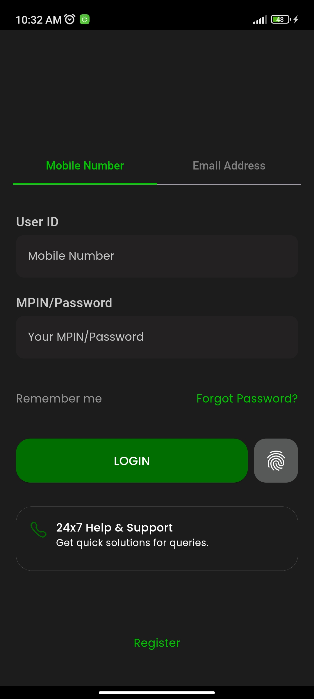
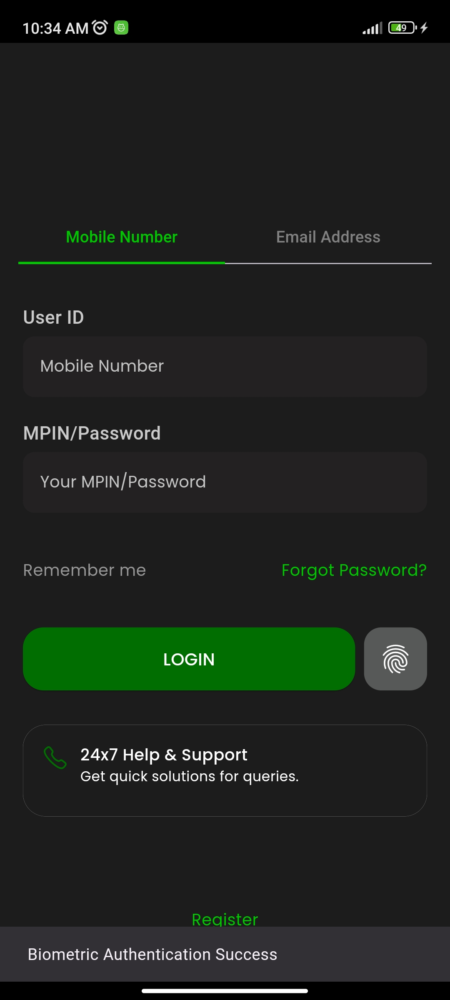

# 🔒 Biometric Authentication App

A simple Flutter application that showcases the biometric authentication process. This app demonstrates how to implement biometric authentication using the device's built-in capabilities.

## 🛠️ Technologies

- **Flutter**
- **Dart**

## ✨ Features

- Implements biometric authentication (fingerprint and facial recognition).
- Provides a user-friendly interface to demonstrate the authentication process.

## 🚦 Running the Project

To run the project locally, follow these steps:

1. **Clone the repository**:

    ```bash
    git clone https://github.com/your-username/biometric-authentication.git
    cd biometric-authentication
    ```

2. **Install dependencies**:

    ```bash
    flutter pub get
    ```

3. **Set up Android files**:

   Update your `MainActivity.kt` file located at `android/app/src/main/kotlin/com/example/password_manager/MainActivity.kt`:

    ```kotlin
    package com.example.password_manager

    import io.flutter.embedding.android.FlutterFragmentActivity

    class MainActivity: FlutterFragmentActivity() {
        // ...
    }
    ```

   Update your `AndroidManifest.xml` located at `android/app/src/main/AndroidManifest.xml`:

    ```xml
    <manifest xmlns:android="http://schemas.android.com/apk/res/android" package="com.example.password_manager">
        <uses-permission android:name="android.permission.USE_BIOMETRIC"/>
        <application
            android:label="password_manager"
            android:name="${applicationName}"
            android:icon="@mipmap/ic_launcher">
        <!-- Other configurations -->
        </application>
    </manifest>
    ```

4. **Run the app**:

    ```bash
    flutter run
    ```

## 📦 Project Structure

```bash
lib/
├── service/
│   └── local_auth.dart    # Service for handling biometric authentication
├── widgets/
│   ├── button.dart        # Custom button widget
│   ├── icon_button.dart   # Custom icon button widget
│   └── textfield.dart     # Custom text field widget
├── auth.dart              # Authentication logic
└── main.dart              # Entry point of the application
└── pubspec.yaml           # Project configuration and dependencies
```

### 🔐 How It Works

The app uses the Local Authentication Plugin to access biometric sensors like fingerprint or face ID. Upon launching the app, users can tap a button to initiate biometric authentication. If the device supports biometrics and the user has registered their biometrics (e.g., fingerprint), the app prompts the user to authenticate.
```
If the authentication is successful, a success message is displayed.
If the authentication fails, an error message is shown.
```

### 📲 Enabling Biometrics on Your Device

Make sure biometric authentication is enabled on your device:
```
Android: Go to Settings > Security > Fingerprint/Face Unlock to enable biometrics.
iOS: Go to Settings > Face ID & Passcode or Settings > Touch ID & Passcode.
```

## 🎥 Photos
<div>
  
  
</div>
